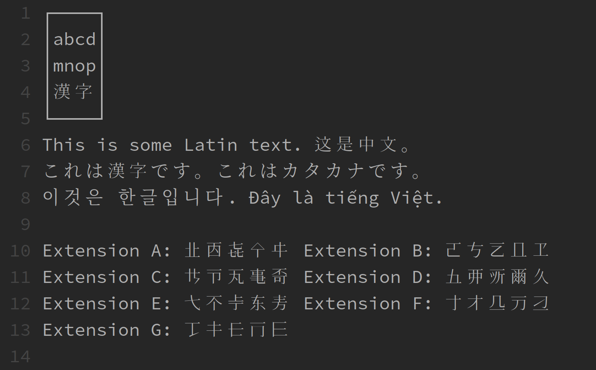

Kage Console
============
Kage Console is a font designed to be used for computational linguistics in CJKV languages (or any time it is desirable to 
work with source code and CJKV scripts together in a single font). It is
designed to provide a consistent, source-code-friendly monospace style for all Latin characters (including Vietnamese) as
well as maximal coverage of CJKV scripts, including CJK Unified Ideograph Extensions A-G.



## Background
Manipulating digital versions of texts that use rare CJKV characters (such as [the Guangyun](https://en.wikipedia.org/wiki/Guangyun) in [xml format](https://github.com/cjkvi/cjkvi-dict/blob/master/sbgy.xml)).
Requires working with a lot of obscure characters that are not supported in standard fonts. Installing a specialty font like [Hanazono Mincho](http://fonts.jp/hanazono/) can allow these characters to be displayed (via a "fallback" font mechanism), but probably in a very different style than the editor font.

One option to provide a consistent look and feel is to simply use Hanazono Mincho as a terminal/editor font, but this is not ideal for editing source code, etc. It is preferable to combine a more source-code-optimized font with Hanazono Mincho. In theory this is possible with a Composite Font Representation (see ISO/IEC 14496-28:2012 [here](https://standards.iso.org/ittf/PubliclyAvailableStandards/index.html)). However support for this standard is limited to macOS, and even there its support appears incomplete.

(On macOS, iTerm nearly provides a solution with its option to specify a separate "non-ASCII" font, but that "non-ASCII" font is unfortunately used for Vietnamese Quốc ngữ as well as non-Latin scripts.)

An alternative solution is to build a custom font by merging together several other fonts. This is how Kage Console is built.

## How it works
The `build.sh` script first downloads [Source Code Pro](https://github.com/adobe-fonts/source-code-pro), [Source Han Serif](https://github.com/adobe-fonts/source-han-serif), and Hanazono Mincho ([modified to include Extension G characters](https://github.com/bellkev/glyphwiki-afdko)) as inputs. Hanazono Mincho is a font derived from the data at [GlyphWiki](https://glyphwiki.org/). (It would be preferable to use sans-serif fonts across the board if possible, but the options to produce sans-serif fonts from GlyphWiki data are still quite limited. As a compromise, a sans-serif font is used for all Latin characters and serif fonts for all non-Latin CJKV scripts, providing pretty good quality and consistency.)

Once downloaded, AFDKO tools are used to merge pieces of all the fonts together. The `*_blocks` files specify which [Unicode Blocks](http://www.unicode.org/Public/UNIDATA/Blocks.txt) to get from which font. The `ttx` tool is used dump the character code/glyph ID mappings for the input fonts, and `mapping.py` uses this data to create "glyph alias files" usable by AFDKO. The AFDKO `mergefonts` and `makeotf` tools can then be used to combine all the inputs into one output `KageConsoleA.otf` file that encodes all of the same characters as `HanaMinA.otf` from the Hanazono Mincho font.

## Building the font
Building the font requires Python 3, Bash, and [AFDKO](https://github.com/adobe-type-tools/afdko). Assuming Git, Bash, and Python 3 are installed, you can build like this:

```shell
pip3 install afdko
git clone https://github.com/bellkev/kage-console
cd kage-console && ./build.sh
```
The necessary source fonts will be downloaded and merged, producing an OTF font file called `KageConsoleA.otf` in the `out` directory.

## Installing the font
The KageConsoleA.otf font is meant to be used together with the HanaMinB.otf and HanaMinC.otf fonts available [here](https://github.com/bellkev/glyphwiki-afdko). Because the full set of fonts includes >64k glyphs, some method of composing them together is needed. In Linux, this can be done with Fontconfig something like this:

```xml
<?xml version='1.0'?>
<!DOCTYPE fontconfig SYSTEM 'fonts.dtd'>
<fontconfig>
 <alias>
  <family>monospace</family>
  <prefer>
   <family>KageConsoleA</family>
   <family>Hanazono Mincho B</family>
   <family>Hanazono Mincho C</family>
  </prefer>
 </alias>
</fontconfig>
```

Simply specifying "monospace" as the desired font in an application should then target Kage Console, falling back to Hanazono Mincho B-C for additional CJK ideographs as needed.

## Stability and known issues
This font should be considered highly experimental. Use at your own risk.

The current build process merges the input fonts quite naively. It would almost certainly benefit from additional modifications to the final font file (hints, metrics, etc) after merger.

There is also no validation done yet to check for coverage of all the blocks specified in `*_blocks` files. Characters in some specified blocks (especially non-CJKV blocks) may be missing.

## Why "Kage Console"?
The name refers to the [KAGE（影）system](http://kamichi.jp/kage.html) used on GlyphWiki to render relatively simple stroke information that can be edited on that site into the higher-resolution SVG paths that go into fonts.
